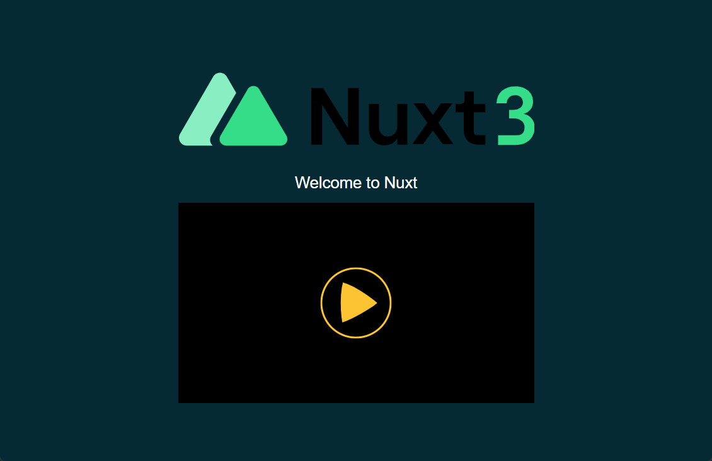

# THEOplayer Web SDK と Nuxt3 フレームワークを使ったストリーミング プレーヤー アプリの実装例

[英語 (English)](./README.md)

このリポジトリでは、シンプルなストリーミング プレーヤー アプリの実装例として、THEOplayer Web SDK と Nuxt3 (Vue3/Viteを利用) フレームワークを統合する方法について公開しています。

THEOplayer は、THEO Technologies によって開発されたユニバーサル ビデオ プレーヤー ソリューションです。 THEOplayer は、複数のプラットフォーム (HTML5 (Web)、Apple iOS、Apple tvOS、Google Android、Google Android TV、Samsumg Tizen、LG webOS、Amazon FireTV、ROKU など) 用のプレーヤー SDK を提供し、HLS、MPEG-DASH、広告、DRM などを様々な機能をサポートします。

Nuxt は、JavaScript を実行している任意のプラットフォームにデプロイできる最新のパフォーマンスの高い Web アプリケーションを構築するための MIT ライセンスに基づくオープンソース フレームワークです。

Nuxt はビュー エンジンとして Vue.js を使用します。 Vue 3 の機能はすべて Nuxt で利用できます。 Nuxt の詳細については、[Nuxt 3 の紹介](https://v3.nuxtjs.org/getting-started/introduction) 記事を参照してください。

このプレーヤーの実装例では、Nuxt3 CLI (nuxi) ツールによって提供されるスターター テンプレートを使って用意され、Nuxt3 およびコンポジション API を使用して、プレイヤーを統合します。

## THEOplayer Web SDK を統合するためのステップバイステップ

### 前提条件

このガイドでは、次の開発ツールが使用されています。

| 開発ツール | バージョン |
| ----- | -------: |
| npm   | 8.19.2   |
| yarn  | 1.22.5   |
| node  | v16.18.0 |

### 1. Nuxt3 アプリ テンプレートを作成する

次のコマンドを実行して、新規の Nuxt3 アプリケーション テンプレートを作成します。

```shell
npx nuxi init theoplayer-web-nuxt3-example
```

コマンド出力は次のようになります。

```text
yarn install
yarn install v1.22.5
info No lockfile found.
[1/4] Resolving packages...
[2/4] Fetching packages...
 :
[4/4] Building fresh packages...
success Saved lockfile.
$ nuxt prepare
Nuxi 3.0.0-rc.12
√ Types generated in src/.nuxt
Done in 5.76s.
```

### 2. Nuxt3 ソースコード群を `./src` ディレクトリに移動する

これは任意のステップですが、本リポジトリでは `src` ディレクトリを利用します。

Vue Web アプリケーションでは、プロジェクトのルート ディレクトリの下の `./src` ディレクトリ内のソース ファイル/ディレクトリにソースコード群が配置されることを期待されてますが、Nuxt Web アプリケーションの既定では、ソース ファイル/ディレクトリがルート プロジェクト ディレクトリの下に、ソースコード群がフラットに配置されることが期待されています。混乱を避けるため、このリポジトリでは、Nuxt Web アプリケーションのソースコードを `./src` ディレクトに移動します。

Nuxt3 Web アプリケーションのソース ファイル/ディレクトリを移動する場合は、以下の手順に従ってください:

#### 2.1. `src` ディレクトリを作成し、`app.vue` を `./src` に移動する

Nuxt3 アプリのスターター テンプレートを作成したら、次のコマンドを実行します:

```shell
mkdir src && mv app.vue ./src/
```

#### 2.2. `tsconfig.json` を変更する

以下のように `./tsconfig.json` を変更します: `extend` プロパティを `./.nuxt/tsconfig.json` から `./src/.nuxt/tsconfig.json` に変更します。

```typescript
{
  // https://v3.nuxtjs.org/concepts/typescript
  "extends": "./src/.nuxt/tsconfig.json",
}
```

### 3. 必要なコンポーネントをインストールする

次のコマンドを実行して、Vue フレームワーク パッケージの依存関係をインストールします。

```shell
yarn install
```

> yarn コマンド出力の `esbuild` モジュールに関する情報メッセージは無視できます。

### 4.THEOplayer を統合する

#### 4.1 モジュール宣言の追加 (THEOplayer.d.ts)

次のコマンドを実行して、THEOplayer Web SDK の型定義モジュールを含む theoplayer NPM パッケージをインストールします。

```shell
yarn add theoplayer
```

#### 4.2 THEOplayer Web SDK の `Player.vue` を追加

次のコードを `src/components` フォルダに `Player.vue` として追加します。
このコードは Vue3 Composition API に基づいており、上位の（親の）コンポーネントから指定された `source` 配列変数を引数として使って、プレイヤーが動作します。

```typescript
<script setup lang="ts">
import { ref, onMounted } from "vue";

const theoplayer = ref<HTMLElement | null>(null);
const props = defineProps<{ source: Array<any> }>();

function playerInit() {
  if (theoplayer.value != null) {
    console.log(theoplayer.value)
    const player = new window.THEOplayer.Player(theoplayer.value, {
      fluid: true,
      libraryLocation: "//cdn.theoplayer.com/dash/theoplayer/",
    });
    player.source = {
      sources: props.source,
    };
  }
}

onMounted(() => {
  playerInit();
});
</script>

<template>
  <div
    class="theoplayer-container video-js theoplayer-skin vjs-16-9 theoplayer"
    ref="theoplayer"
  ></div>
</template>

<style scoped>
.theoplayer-container {
  margin: 0 auto;
  padding-top: 28.13%;
  width: 50%;
}
</style>
```

#### 4.3 `Welcome.vue` と `NuxtLogo.vue` を追加する

次のコードを `src/components` フォルダーに `Welcome.vue` および `NuxtLogo.vue` として追加します:

`Welcome.vue`:

```typescript
<script setup lang="ts">
import Player from "./Player.vue";
import { ref } from "vue";
const source = ref([
  {
    type: "application/x-mpegurl",
    src: "//cdn.theoplayer.com/video/elephants-dream/playlist.m3u8",
  },
]);
</script>

<template>
  <div class="container">
    <NuxtLogo />
    <h1>Welcome to Nuxt</h1>
    <Player :source="source" v-if="source" />
  </div>
</template>

<style>
body {
  margin: 0;
}

.container {
  height: 100vh;
  width: 100vw;
  background: rgb(1, 42, 53);
  display: flex;
  flex-direction: column;
  align-items: center;
  justify-content: center;
}

h1 {
  color: white;
  text-align: center;
  font-family: helvetica, arial, sans-serif;
  font-weight: 400;
}
</style>
```

`NuxtLogo.vue`:

```typescript
<template>
  <svg viewBox="0 0 221 65" fill="none" xmlns="http://www.w3.org/2000/svg" class="h-8"><g clip-path="url(#a)"><path fill="currentColor" d="M82.5623 18.5705h7.3017l15.474 24.7415V18.5705h6.741v35.0576h-7.252L89.3025 28.938v24.6901h-6.7402V18.5705ZM142.207 53.628h-6.282v-3.916c-1.429 2.7559-4.339 4.3076-8.015 4.3076-5.822 0-9.603-4.1069-9.603-10.0175V28.3847h6.282v14.3251c0 3.4558 2.146 5.8592 5.362 5.8592 3.524 0 5.974-2.7044 5.974-6.4099V28.3847h6.282V53.628ZM164.064 53.2289l-6.026-8.4144-6.027 8.4144h-6.69l9.296-13.1723-8.58-12.0709h6.843l5.158 7.2641 5.106-7.2641h6.895l-8.632 12.0709 9.295 13.1723h-6.638ZM183.469 20.7726v7.6116h7.149v5.1593h-7.149v12.5311c0 .4208.17.8245.473 1.1223.303.2978.715.4654 1.144.4661h5.532v5.9547h-4.137c-5.617 0-9.293-3.2062-9.293-8.8109V33.5484h-5.056v-5.1642h3.172c1.479 0 2.34-.8639 2.34-2.2932v-5.3184h5.825Z"></path><path fill-rule="evenodd" clip-rule="evenodd" d="M30.1185 11.5456c-1.8853-3.24168-6.5987-3.24169-8.484 0L1.08737 46.8747c-1.885324 3.2417.47133 7.2938 4.24199 7.2938H21.3695c-1.6112-1.4081-2.2079-3.8441-.9886-5.9341l15.5615-26.675-5.8239-10.0138Z" fill="#80EEC0"></path><path d="M43.1374 19.2952c1.5603-2.6523 5.461-2.6523 7.0212 0l17.0045 28.9057c1.5603 2.6522-.39 5.9676-3.5106 5.9676h-34.009c-3.1206 0-5.0709-3.3154-3.5106-5.9676l17.0045-28.9057ZM209.174 53.8005H198.483c0-1.8514.067-3.4526 0-6.0213h10.641c1.868 0 3.353.1001 4.354-.934 1-1.0341 1.501-2.3351 1.501-3.9029 0-1.8347-.667-3.2191-2.002-4.1532-1.301-.9674-2.985-1.4511-5.054-1.4511h-2.601v-5.2539h2.652c1.701 0 3.119-.4003 4.253-1.2009 1.134-.8006 1.701-1.9849 1.701-3.5527 0-1.301-.434-2.3351-1.301-3.1023-.834-.8007-2.001-1.201-3.503-1.201-1.634 0-2.918.4837-3.853 1.4511-.9.9674-1.401 2.1517-1.501 3.5527h-6.254c.133-3.2358 1.251-5.7877 3.352-7.6558 2.135-1.868 4.887-2.8021 8.256-2.8021 2.402 0 4.42.4337 6.055 1.301 1.668.834 2.919 1.9515 3.753 3.3525.867 1.4011 1.301 2.9523 1.301 4.6536 0 1.9681-.551 3.636-1.651 5.0037-1.068 1.3344-2.402 2.235-4.004 2.7021 1.969.4003 3.57 1.3677 4.804 2.9022 1.234 1.5011 1.852 3.4025 1.852 5.7043 0 1.9347-.468 3.7028-1.402 5.304-.934 1.6012-2.301 2.8855-4.103 3.8529-1.768.9674-3.953 1.4511-6.555 1.4511Z" fill="#00DC82"></path></g><defs><clipPath id="a"><path fill="#fff" d="M0 0h221v65H0z"></path></clipPath></defs></svg>
</template>

<style>
svg {
  width: 50vw;
}
</style>
```

#### 4.4 `src/global.d.ts` に THEOplayer の型宣言の読み込みを追加する

次のスクリプト コードを `src/global.d.ts` として追加します。

```typescript
// Import types for THEOplayer
import theoplayer from "theoplayer";

declare global {
    interface Window {
        THEOplayer: typeof theoplayer;
    }
}
```

#### 4.5 `app.vue` に THEOplayer JavaScript/CSS モジュールを追加する

次のセクションを `src/app.vue` に追加して、THEOplayer CSS と JavaScript をインポートします。

```html
<script setup lang="ts">
useHead({
  meta: [
    {
      name: 'viewport',
      content: 'width=device-width, initial-scale=1'
    }
  ],
  link: [
    {
      rel: 'stylesheet',
      href: 'https://cdn.theoplayer.com/dash/theoplayer/ui.css'
    }
  ],
  script: [
    {
      type: "text/javascript",
      src: "https:/cdn.theoplayer.com/dash/theoplayer/THEOplayer.js",
      body: true,
    },
  ],
});
</script>
```

#### 4.5 `app.vue` のコンポーネントを変更する

このサンプル Web アプリで THEOplayer をレンダリングするには、`src/app.vue` で `NuxtWelcome` コンポーネントを (セクション 4.3 で作成された) `Welcome` コンポーネントに変更します:

```html
<template>
  <div>
    <Welcome />
  </div>
</template>
```

### 5. このサンプル アプリケーション コードを実行し、ブラウザで開きます

次のコマンドを実行して、コードをコンパイルし、ローカル サーバーを実行して、サンプル アプリケーションをホストします。

```shell
yarn dev
```

コマンド出力は次のようになります。

```text
Nuxi 3.0.0-rc.12
Nuxt 3.0.0-rc.12 with Nitro 0.6.0

  > Local:    http://localhost:3000/

i Vite client warmed up in 2321ms
√ Nitro built in 734 ms
```

`localhost` のホスト名と指定されたポートでアプリケーションを参照して、Vue3 Web アプリケーションの動作を確認できます。

このアプリケーション実装例では、一般に公開されているビルトイン ライセンス付きの THEOplayer プレーヤー SDK を使用しているため、明示的なライセンスなしで THEOplayer の再生機能を有効にすることができますが、ビルトイン ライセンスでは ホワイトリストに登録されたホスト名として `localhost` での動作のみが許可されます。 これは、`localhost` 以外でこのアプリケーションを実行すると、エラー メッセージ ("_The given license is invalid!_") が表示されることを意味します。

スクリーンショットは次のとおりです:



## ローカルの THEOplayer Web SDK を使用する

独自の THEOplayer Web SDK を使用する場合は、(カスタマイズされた) Web SDK をホストする URL を参照するように変更するか、Web SDK を Nuxt3 ソース ツリーの `src/public` フォルダーに配置する必要があります。

次に、以下のファイルを変更して、THEOplayer SDK (JS/CSS とライブラリ) の場所を適切に指定する必要があります。

また、Player クラスの引数に、THEOplayer のポータルで取得したライセンスを設定する必要があります。

* `src/app.vue`
* `src/components/Player.vue`

例えば、SDK ファイルを `src/public/js/theoplayer` フォルダーに配置すると、`src/app.vue` と `src/components/Player.vue` は次のようになります:

`src/app.vue`:

```html
<script setup lang="ts">
useHead({
  meta: [
    {
      name: 'viewport',
      content: 'width=device-width, initial-scale=1'
    }
  ],
  link: [
    {
      rel: 'stylesheet',
      href: '/js/theoplayer/ui.css'
    }
  ],
  script: [
    {
      type: "text/javascript",
      src: "/js/theoplayer/THEOplayer.js",
      body: true,
    },
  ],
});
</script>
```

`src/components/Player.vue`:

```typescript
    const player = new window.THEOplayer.Player(theoplayer.value, {
      fluid: true,
      libraryLocation: "/js/theoplayer/",
      license: "ライセンス文字列"
    });
```

## 最後に

シンプルなプレーヤー アプリの実装例として、THEOplayer Web SDK と Nuxt3 フレームワークを統合する方法についてこのリポジトリで公開しています。詳細は、このリポジトリ内のサンプル アプリのソースコードを参照してください。

ご不明な点がございましたら、お気軽にお問い合わせください。
